# Enterprise LLMOps RAG Architecture

## Mermaid Diagram (for GitHub README)

```mermaid
graph TB
    %% Styling
    classDef frontend fill:#00d9ff,stroke:#0891b2,stroke-width:3px,color:#000
    classDef api fill:#7c3aed,stroke:#5b21b6,stroke-width:3px,color:#fff
    classDef processing fill:#f59e0b,stroke:#d97706,stroke-width:3px,color:#000
    classDef storage fill:#10b981,stroke:#059669,stroke-width:3px,color:#000
    classDef monitoring fill:#ef4444,stroke:#dc2626,stroke-width:3px,color:#fff

    %% Components
    A[🖥️ Client Frontend<br/>Streamlit / React]
    B[⚡ API Gateway<br/>FastAPI<br/>- Authentication<br/>- Rate Limiting<br/>- Request Routing]
    C[🔄 RAG Orchestrator<br/>LangChain<br/>- Query Processing<br/>- Pipeline Management]
    D[📝 Embeddings Service<br/>OpenAI / BGE<br/>- Text Vectorization<br/>- Semantic Encoding]
    E[🗄️ Vector Store<br/>FAISS<br/>- Similarity Search<br/>- High-speed Retrieval]
    F[🤖 LLM Agent<br/>OpenAI GPT-4<br/>- Context-aware Generation<br/>- Multi-turn Conversation]
    G[📊 Monitoring & Logging<br/>Prometheus + Grafana<br/>- Performance Metrics<br/>- Cost Tracking]

    %% Connections
    A -->|HTTP Request| B
    B -->|Process Query| C
    C -->|Generate Embeddings| D
    C -->|Search Similar Docs| E
    D -->|Store Vectors| E
    E -->|Retrieved Context| C
    C -->|Augmented Prompt| F
    F -->|Generated Response| C
    C -->|Return Answer| B
    B -->|HTTP Response| A
    F -->|Metrics & Logs| G
    B -->|Request Logs| G
    C -->|Performance Data| G

    %% Apply styles
    class A frontend
    class B api
    class C,F processing
    class D,E storage
    class G monitoring
```





```


## 🏗️ Architecture

```
┌─────────────┐
│   Client    │
│  Frontend   │
└──────┬──────┘
       │
       ▼
┌─────────────────────────────────────┐
│       API Gateway (FastAPI)         │
│  - Authentication                   │
│  - Rate Limiting                    │
│  - Request Routing                  │
└──────────┬──────────────────────────┘
           │
           ▼
    ┌──────────────────────┐
    │   RAG Orchestrator   │
    │   (LangChain)        │
    └──────────┬───────────┘
               │
       ┌───────┴────────┐
       │                │
       ▼                ▼
┌─────────────┐  ┌──────────────┐
│  Embeddings │  │ Vector Store │
│   Service   │  │   (FAISS)    │
└─────────────┘  └──────────────┘
       │                │
       └────────┬───────┘
                │
                ▼
         ┌─────────────┐
         │  LLM Agent  │
         │  (OpenAI)   │
         └─────────────┘
                │
                ▼
         ┌─────────────┐
         │  Monitoring │
         │  & Logging  │
         └─────────────┘
```


# Enterprise LLMOps RAG

[](https://www.python.org/)  
[](LICENSE)  
[]()

**An end-to-end modular RAG (Retrieval-Augmented Generation) system for enterprise-grade AI-powered question-answering and document analytics.**

---

## **Project Overview**

This project provides a **production-ready modular system** for:

- AI-powered **question-answering** over multiple documents (PDFs, text, databases)
- **Retrieval-Augmented Generation (RAG)** using **LangChain + FAISS + OpenAI**
- Scalable API access via **FastAPI** gateway
- Optional **Streamlit frontend** for interactive demos
- **Enterprise-grade deployment** with Docker, Kubernetes (Minikube/EKS), and CI/CD
- Monitoring and logging via **Prometheus, Grafana, or Evidently AI**
- Modular testing with **pytest** and evaluation metrics (RAGAS, BERTScore, human-in-loop)

---


**Key Modules:**

| Module | Description |
|--------|-------------|
| `api_gateway` | FastAPI endpoints to receive requests from frontend or clients |
| `embeddings` | Embedding generation using OpenAI/BGE for documents/questions |
| `rag_engine` | LangChain orchestrator for retrieval + LLM generation |
| `vector_store` | FAISS-based embeddings storage and retrieval |
| `agents` | Specialized modules (QA, Report generation, Summarization) |
| `evaluation` | Automated and manual RAG evaluation metrics |
| `infra` | Docker and Kubernetes manifests for deployment |
| `frontend_streamlit` | Optional UI for demo/testing |
| `tests` | Pytest-based unit and integration tests |

---

## **Features**

- Modular, **plug-and-play** components  
- Supports **multi-document RAG queries**  
- Enterprise-ready **API gateway**  
- **Vector store** for fast retrieval  
- Optional **monitoring & model evaluation**  
- CI/CD and containerized deployment  

---

## **Installation**

### **1. Clone Repository**

```bash
git clone https://github.com/AyorindeTayo/enterprise-llmops-rag.git
cd enterprise-llmops-rag
```

### **2. Create Python Environment**

```bash
python3 -m venv llmops-env
source llmops-env/bin/activate
```

### **3. Install Dependencies**

```bash
pip install -r requirements.txt
```

### **4. Set Environment Variables**

Create a `.env` file in the root:

```bash
touch .env
```

Add your OpenAI API key:

```env
OPENAI_API_KEY=your_openai_api_key_here
```

---

## **Running Locally**

### **1. Start FastAPI API Gateway**

```bash
uvicorn api_gateway.main:app --reload --host 0.0.0.0 --port 8000
```

- Health check: `http://localhost:8000/health`  
- Ask a question: `POST http://localhost:8000/ask`

### **2. Start Streamlit Frontend (Optional)**

```bash
streamlit run frontend_streamlit/app.py
```

- Access via `http://localhost:8501`

---

## **Testing**

- Run **unit tests**:

```bash
pytest tests/
```

- Tests cover embeddings, QA agents, and API endpoints  
- Mocked LLM calls prevent unnecessary OpenAI API usage during testing  

---

## **Docker & Kubernetes**

### **Docker Build & Run**

```bash
docker build -t llmops-rag:latest ./infra/docker
docker run -p 8000:8000 llmops-rag:latest
```

### **Local Kubernetes (Minikube)**

```bash
minikube start
kubectl apply -f infra/k8s/deployment.yaml
kubectl apply -f infra/k8s/service.yaml
kubectl get pods
kubectl get services
```

### **Production (Amazon EKS)**

1. Push Docker image to **AWS ECR**
2. Update `deployment.yaml` with ECR image URL
3. Deploy using `kubectl apply -f infra/k8s/`  

---

## **Monitoring & Evaluation**

- **Monitoring:** Prometheus + Grafana for API and model metrics  
- **Model evaluation:** Evidently AI for drift, RAGAS, and BERTScore metrics  
- **Logging:** FastAPI logging for requests and errors  

---

## **Best Practices**

- `.env` files **never committed to GitHub**  
- Modular structure allows **independent testing & deployment** of agents, embeddings, RAG engine  
- CI/CD automation ensures **reliable and repeatable deployments**  

---

## **Contributing**

1. Fork repository  
2. Create a branch (`feature/your-feature`)  
3. Commit changes (`git commit -m "Add new agent"`)  
4. Push branch and open a PR  

---


## **License**

[MIT License](LICENSE)

